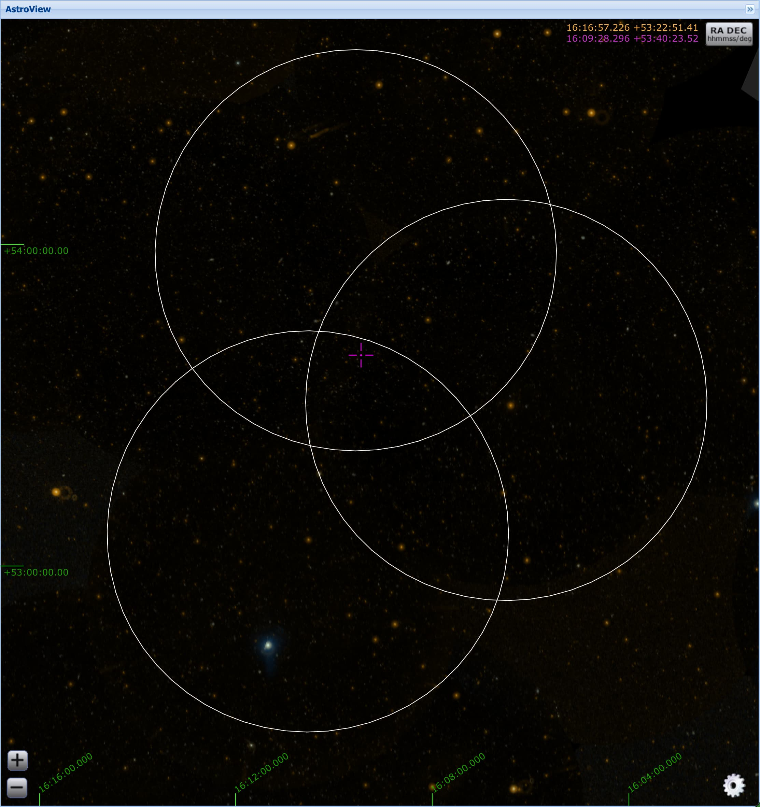

---
jupytext:
  hide_notebook_metadata: true
  text_representation:
    extension: .md
    format_name: myst
    format_version: 0.13
    jupytext_version: 1.16.4
kernelspec:
  display_name: vasca-github
  language: python
  name: vasca-github
---

```{code-cell}
:tags: [remove-cell]

# ruff: noqa: T201
```

```{code-cell}
:tags: [remove-input]

import pandas as pd
from IPython.display import HTML, display
from itables import init_notebook_mode, show

init_notebook_mode(all_interactive=True)

# Modify Table CSS so with colors that work ok in light and dark themes
class_specific_css = """
.dataTable th {
    font-weight: normal;
    background-color: #075;
    color: #fff;
}
.dataTable td {
        border-color: #f0f;
        background-color: #333;
        color: #fff;
}
.dt-container {
  font-size: small;
}

"""
display(HTML(f"<style>{class_specific_css}</style>"))
```

# Pipeline

This is a tutorial showcasing VASCA's pipeline flow on a simple example. We will go through
all the steps equivalent to what is done in [](#vasca_pipe.run_from_file). The goal
is to create a VASCA [](#Region) from multiple [](#GALEXField) for which we download the
raw data online from [MAST](https://astroquery.readthedocs.io/en/latest/mast/mast.html).
We apply quality cuts and do source clustering followed by variability analysis and
finally source cross-matching.

For this tutorial we are interested in the near-ultraviolet (NUV) observations
by GALEX. We are going to look at neighboring/overlapping fields all of which
contain the location of famous Tidal Disruption Event [_PS1-10jh_](https://en.wikipedia.org/wiki/Pan-STARRS#Selected_discoveries) discovered by Pan-STARRS and observed by GALEX in 2010.

:::{figure-md} galex-fields-ps1-10jh


Field footprints for GALEX observations around the location of PS1-10jh (purple
crosshair). Sreenshot from [MAST Portal](https://mast.stsci.edu/portal/Mashup/Clients/Mast/Portal.html)
:::

+++

## General Configuration

The standard pipeline processing starts by reading a yaml file. To keep this tutorial
simple, we are going to introduce parts of the configuration step by step at the point
where they are required in the pipeline flow.

```{note}
An important premise of the configuration is that each parameter needs to be
configured explicitly. This means even default values are specified all the time. This
is a design decision purposefully made in order to ensure transparent and complete
configurations. As a result, all possible parameters are always included when looking
at configuration file.
```

Let's begin with the ``general`` section. Here, basic information and functionality is
configured. The ``name`` of the pipeline run specifies also the name of directory in
which all results will be stored. The location of output directory is at ``out_dir_base``
relative to the root directory of the package.

VASCA uses the powerful logging system provided by [loguru](https://loguru.readthedocs.io/en/stable/index.html).
The configuration specifies the [``log_level``](https://loguru.readthedocs.io/en/stable/api/logger.html#loguru._logger.Logger.level),
which we are going to set to debugging mode here. By default VASCA is going to save
all logging messages in a file stored in the output directory. ``log_file`` specifies
the name of that file, while ``default`` tells the pipeline to use a default name.

Parallel processing of the field-level analysis can be enabled when setting the number
of CPU threads ``nr_cpus > 1``.

VASCA can include field-averaged reference data, if such data is available additional
to the visit-level data from the instruments mission pipeline. To save memory/storage
and computation time it is configurable wether to include reference sources in the
final [](#Region)-file (``save_ref_srcs``) and to repeat already processed fields that
are included in the region (``run_fields``).

```{code-cell}
# Dictionary holding the configuration
config = {}

# General section of the configuration
config["general"] = {
    "name": "simple_pipe",
    "out_dir_base": "docs/tutorial_resources/vasca_pipeline",
    "log_level": "DEBUG",
    "log_file": "default",
    "nr_cpus": 1,
    "save_ref_srcs": True,
    "run_fields": True,
}
```

:::{tip}
In case the output location is on a remote server and multiple users should be
able to edit the data, i.e., reprocess data using an updated configruation, then
one needs to manage user access priviliges. For convenience this can be done
using [``umask``](https://en.wikipedia.org/wiki/Umask):
```Python
import os
os.umask("0o003", 0)
```
This will grand user and group full permissions. The setting is only persistant
throughout the Python session.
:::

+++

The pipeline begins with some prerequisites including enabling logging and creating
the output directory

```{code-cell}
import sys
from loguru import logger
from pathlib import Path
from importlib.resources import files

# Setup output directory
out_dir_base = Path(files("vasca").parent / config["general"]["out_dir_base"])
out_dir_base.mkdir(parents=True, exist_ok=True)

pipe_dir = out_dir_base / config["general"]["name"]
pipe_dir.mkdir(parents=True, exist_ok=True)

# Path to log file
log_file = (
    pipe_dir / f'{config["general"]["name"]}.log'
)  # Pipeline name is used by default

# Logger configuration, both to stdout and .log file
log_cfg = {
    "handlers": [
        {
            "sink": sys.stdout,
            "format": "<green>{time:YYYY-MM-DD HH:mm:ss.SSSS}</green> "
            "<cyan>{name}</cyan>:<cyan>{line}</cyan> |"
            "<level>{level}:</level> {message}",
            "level": config["general"]["log_level"],
            "colorize": True,
            "backtrace": True,
            "diagnose": True,
        },
    ],
}
logger.configure(**log_cfg)  # Set config
logger.add(log_file)  # Add file logger
logger.enable("vasca")  # Enable logging

# Some initial logging messages
logger.info(f"Runing '{config['general']['name']}'")
logger.debug(f"Config. file: {log_file}")
```

## Resources
Next is the section about resource handling. This specifies the method used to load
(``load_method``) field data and which data products should be included (tables,
tables plus visit-level images, or only metadata ``load_products``). Additionally
the ``coadd_exists`` flag tells the pipeline wether it can expect co-added (field-
averaged) data. Finally, ``field_kwargs`` allows to pass parameters directly to
the ``init`` function of a field class.

Here we are going to initialize fields from local raw data, if present. Else the
required data is downloaded from MAST. All data products will be included including
co-add data. Using the [](#ResourceManager) we can tell the field class where to
locate the data.

```{code-cell}
from vasca.resource_manager import ResourceManager

# Get the data locations using ResourceManager
rm = ResourceManager()
data_path = rm.get_path("docs_resources", "vasca")
visits_data_path = rm.get_path("gal_visits_list", "vasca")

# Resource section of the configuration
config["resources"] = {
    "load_method": "MAST_LOCAL",
    "load_products": "ALL",
    "coadd_exists": True,
    "field_kwargs": {
        "data_path": data_path,
        "visits_data_path": visits_data_path,
    },
}
```

## Observations
The observations section of the configuration is responsible for configuring
which combination of instrument (``observatory``) and filter (``obs_filter``)to
load data. Also it specifies the exact list of fields to load (``obs_field_ids``).

In a later step we will also add here the selection parameters (``selection``) used
for the quality cuts on the data and the field-level clustering settings
(``cluster_det``).

```{code-cell}
config["observations"] = [
    {
        "observatory": "GALEX",
        "obs_filter": "NUV",
        "obs_field_ids": [
            2432438716514435072,  # MISDR1_10450_0621
            3880803393752530944,  # MISGCSN2_10493_0117*
            2529617952223789056,  # ELAISN1_04
            2529969795944677376,  # ELAISN1_09
            2597664528044916736,  # PS_ELAISN1_MOS15*
            6374997199557754880,  # AIS_116_1_53
            6374997210295173120,  # AIS_116_1_63
        ],
        # "cluster_det": {},
        # "selection": {},
    },
    # More instruments/filters...
]

# *These are the only fields with observations in the relevant time frame onwards from 2010
```

Find below the visit metadata about the fields under investigation.

```{code-cell}
:tags: [hide-input]

from astropy.table import Table

df_gal_visits = (
    Table.read(visits_data_path)
    .to_pandas()
    .apply(lambda x: x.str.decode("utf-8") if x.dtype == "O" else x)
)
query = f"ParentImgRunID in {list(config['observations'][0]['obs_field_ids'])}"
df_select = df_gal_visits.query(query)
show(
    df_select,
    classes="display nowrap compact",
    scrollY="300px",
    scrollCollapse=True,
    paging=False,
    columnDefs=[{"className": "dt-body-left", "targets": "_all"}],
)
```

In the next step we will initialize a VASCA [](#Region) with all fields sequentially.

```{code-cell}
:tags: [hide-output]

from vasca.region import Region

rg = Region.load_from_config(config)
```

This populates the region object with all specified fields, the relevant metadata is
stored in {term}`tt_fields`

```{code-cell}
rg.info()
# rg.tt_fields
```

```{code-cell}
:tags: [remove_input]

df_tt_fields = rg.tt_fields.to_pandas().apply(
    lambda x: x.str.decode("utf-8") if x.dtype == "O" else x
)
show(
    df_tt_fields,
    classes="display nowrap compact",
    scrollY="300px",
    scrollCollapse=True,
    paging=False,
    columnDefs=[{"className": "dt-body-left", "targets": "_all"}],
)
```

```{code-cell}
# To be continued ...
```
