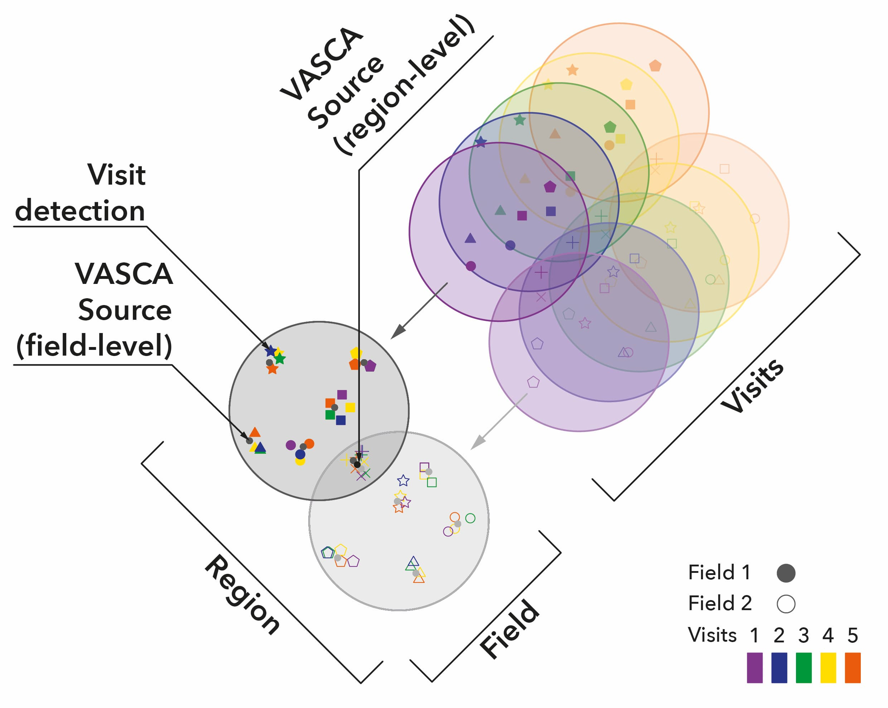

# Data Model

VASCA uses a hierarchical data model which wich defines cosmic _sources_, individual
_fields_ and whole _regions_ in the celestial sky.

:::{figure-md} data-model_


The VASCA data model.
::: 

This model aims to abstract the input data, astronomical photometric detection lists, in
in the most general way possible in order to allow integration of data from multiple
instruments and parallel processing of the data.

## Input Data
Typically, astronomical photometric surveys observe the sky by segmenting it into fields
which correspond to the field of view as defined by the instrument's telescope optics. A
field is then defined by a central coordinate and the diameter of the field of view.

VASCA relies as its input on the science data products that missions/organizations create
from their observational raw data. Specifically this means VASCA takes tables of
photometric detections that have a field and visit ID. For a reference of the full list
of required columns can be see here: [{class}`BaseField`](#base_field), [{class}`Region`](#vasca.tables_dict.region).

In the case of GALEX, the detection lists created by the mission pipeline ("mcat" files)
have a large number of different observables and parameters (columns) per detection (see
GALEX docs [here](http://www.galex.caltech.edu/wiki/Public:Documentation/Appendix_A.1)).
A subset is used by VASCA, where GALEX specific parameters are added to the ones used by
{class}`BaseField`. This is implemented in the instrument specific [](#TableCollection)
object [](#GALEXField) and its corresponding [column definitions](#vasca.tables_dict.galex_field).

## Data Structures
All data structures in VASCA are based on [](#TableCollection). As the name tells, these
objects describe a collection of astropy [Table](inv:#astropy.table.Table).
```{autodoc2-object} vasca.tables.TableCollection
render_plugin = "myst"
no_index = true
annotations = false
docstrings = false
hidden_objects = ["undoc", "dunder", "inherited"]
```

### VASCA Columns
See the full list of data columns defined by VASCA below:

```{code-cell}
:tags: [remove-input]

from itables import init_notebook_mode, show
import pandas as pd
from vasca.tables_dict import dd_vasca_columns
from IPython.display import HTML, display

init_notebook_mode(all_interactive=True)


# Modify Table CSS so with colors that work ok in light and dark themes
class_specific_css = """
.dataTable th {
    font-weight: normal;
    background-color: #075;
    color: #fff;
}
.dataTable td {
        border-color: #f0f;
        background-color: #333;
        color: #fff;
}
.dt-container {
  font-size: small;
}

"""
display(HTML(f"<style>{class_specific_css}</style>"))

# Get column definitions
df_cols = pd.DataFrame.from_dict(dd_vasca_columns)

show(
    df_cols.T,
    classes="display nowrap compact",
    scrollY="300px",
    scrollCollapse=True,
    paging=False,
    columnDefs=[{"className": "dt-body-left", "targets": "_all"}],
)
```
