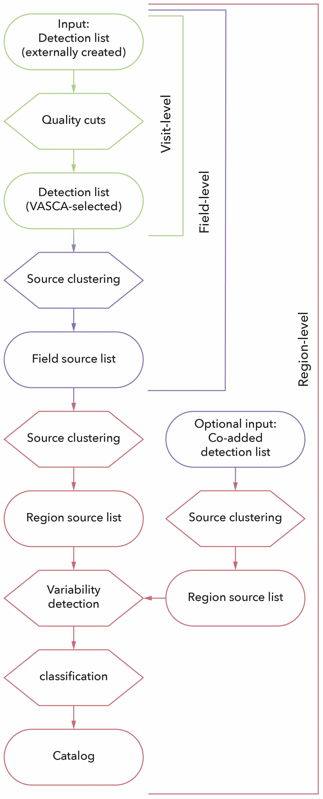

# Pipeline

VASCA's pipeline flow is composed of individual components for which parallel processing
is enabled. The diagram below shows the three-leveled modular design of the pipeline. A
comprehensive tutorial can be found [here](../tutorials/tutorial_pipe.md).

:::{figure-md} processing-flow

The pipeline processing flow in VASCA
::: 